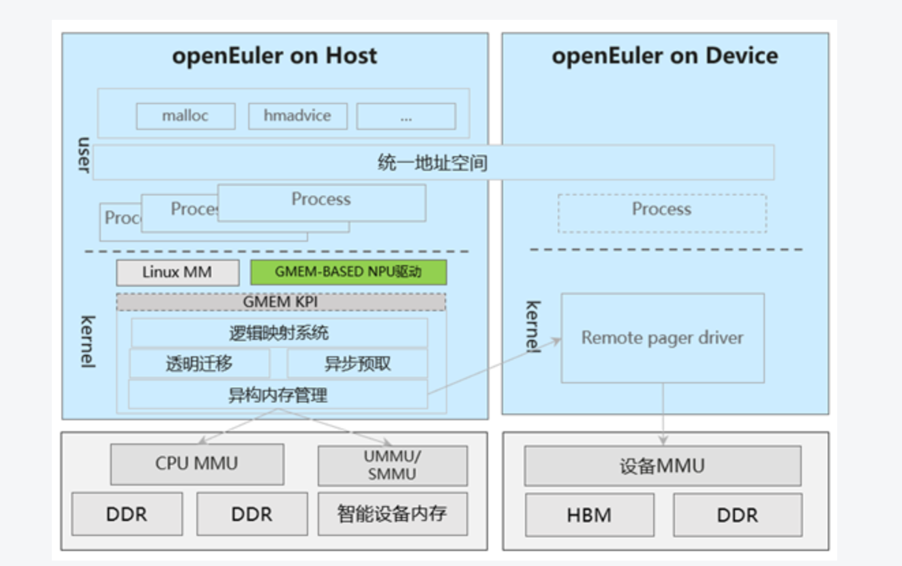
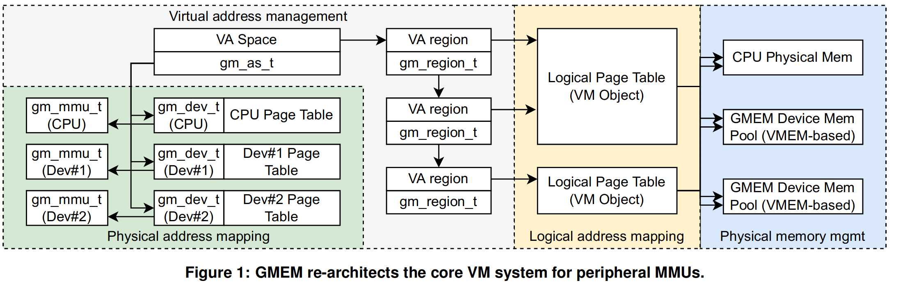
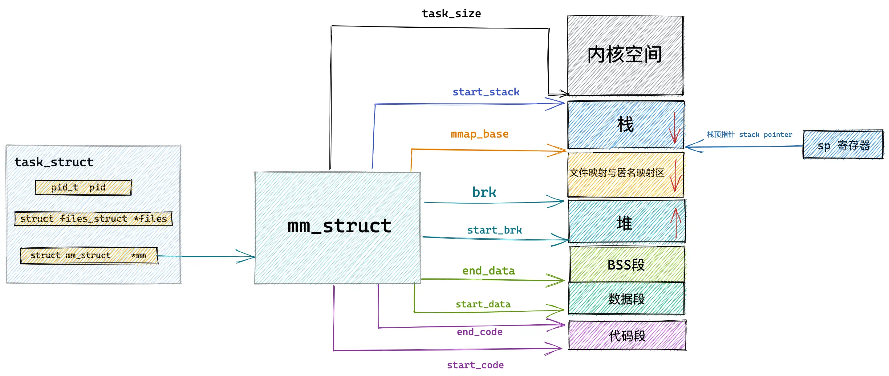
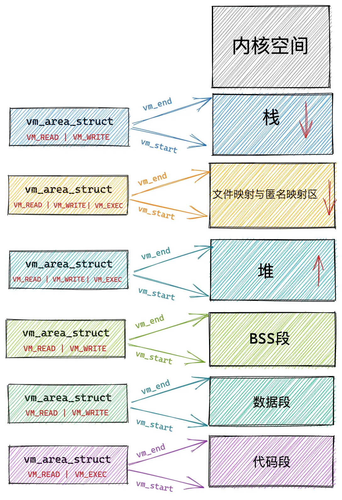
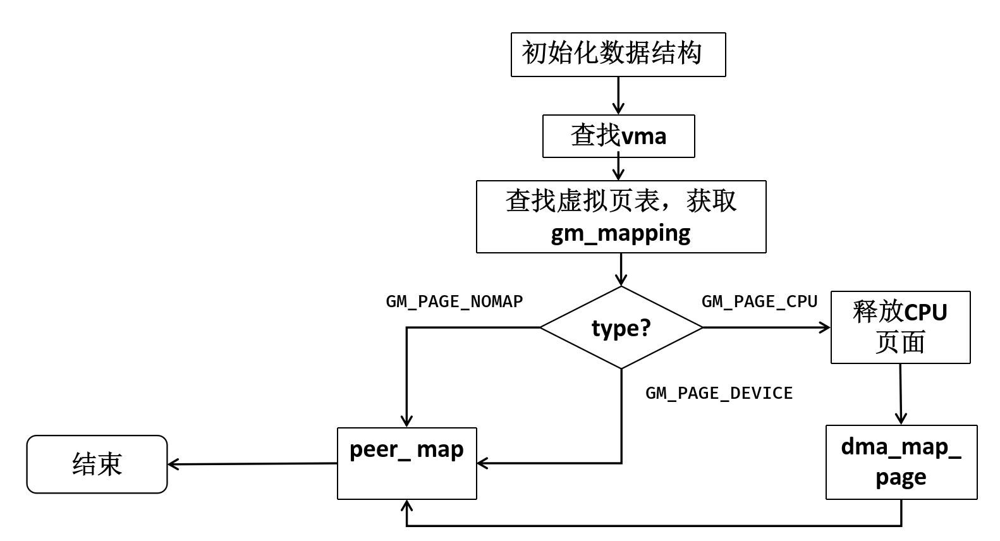
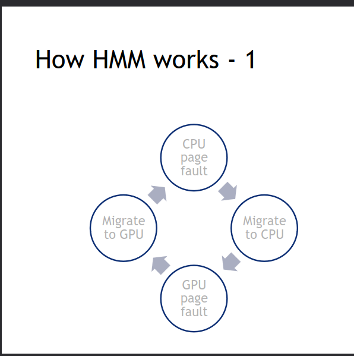
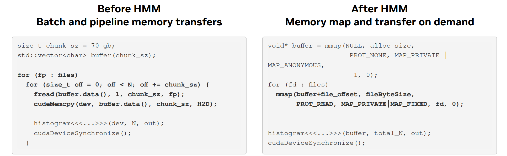

# GMEM vs HMM


## 1.GMEM

### 1.1研究背景

后摩尔时代正不断涌现GPU、TPU、FPGA等领域专用加速器，这些设备都有着自己的内存(DRAM),设备驱动开发者都需要不断重复"造轮子"设计复杂的内存管理系统来管理内存。尽管加速器内存管理系统的高层设计逻辑与Linux内核中的相似，但它们却不能复用Linux内核中更趋成熟的内存管理代码。

> 当前异构侧数据管理CPU与异构侧分离，数据显式搬移，易用性和性能难以平衡：异构设备HBM内存严重不足，应用手动SWAP方案性能损耗大且通用性差；搜推、大数据场景存在大量无效数据搬移，缺少高效内存池化方案，急需统一的有效对等内存管理机制，Linux现有HMM框架搁浅，编程复杂度高且依赖人工调优，NV、AMD虽尝试接入，但由于架构问题导致代码缺乏通用性，性能可移植性差，引起上游OS社区反弹。

因此，作者想提出一套通用的内存管理框架，使得设备驱动开发者能够重用，将内存管理交由给Linux内核管理，减轻设备驱动开发者的工作。


### 1.2 GMEM的设计

GMEM (Generalized Memory Management) 提供了异构互联内存的中心化管理，通过修改Linux内核中的内存管理模块，实现一系列通用的KPI接口，设备驱动只需要相关的mmu函数，并调用KPI接口来注册设备内存，即可将设备内存托管给Linux内核。GMEM的设计架构如图所示：
 


### 1.3 GMEM的运行机制
一个外围设备要接入GMEM的过程如下:
- 启动阶段，设备
    - 调用 `gm_dev_create()`函数,相当于在GMEM中将本设备注册
    - 实现`sturct gm_mmu`中的接口函数，如`peer_va_alloc_fixed()`, `peer_va_free()` 分配设备的虚拟内存，
    - 调用 `gm_dev_register_physmem`函数，在GMEM中注册设备可用的物理内存
- 当设备上下文初始化完毕，CPU需要调用`gm_as_create`来创建一个地址空间`gm_as_t`(该地址空间与设备共享)，并用进程的内存控制块中的`gm_as`指针指向它。
- 设备调用 `gm_as_attach`函数即可附加到进程的地址空间，CPU页表即可管理设备内存。
- 当设备出现缺页异常时，调用`gm_dev_fault`函数来处理，或者调用该函数来进行数据预取。`gm_dev_fault`会利用DMA机制将CPU内存传输到设备内存中。



#### 1.3.1 前置知识

linux内核中采用了一个叫做内存描述符的 mm_struct 结构体来表示进程虚拟内存空间的全部信息。
 
```c 
struct mm_struct {
    unsigned long task_size;    /* size of task vm space */
    unsigned long start_code, end_code, start_data, end_data;
    unsigned long start_brk, brk, start_stack;
    unsigned long arg_start, arg_end, env_start, env_end;
    unsigned long mmap_base;  /* base of mmap area */
    unsigned long total_vm;    /* Total pages mapped */
    unsigned long locked_vm;  /* Pages that have PG_mlocked set */
    unsigned long pinned_vm;  /* Refcount permanently increased */
    unsigned long data_vm;    /* VM_WRITE & ~VM_SHARED & ~VM_STACK */
    unsigned long exec_vm;    /* VM_EXEC & ~VM_WRITE & ~VM_STACK */
    unsigned long stack_vm;    /* VM_STACK */

    ........

```

现在我们主要关注**内存映射区**，在GMEM中CPU和设备主要共享的虚拟空间就是这个区域。

在内存映射区内存地址的增长方向是由高地址向低地址增长，mmap_base 定义内存映射区的起始地址。进程运行时所依赖的动态链接库中的代码段，数据段，BSS 段以及我们调用 mmap 映射出来的一段虚拟内存空间就保存在这个区域。


划分出的区域又能够分成许多子区域，Linux内核是使用虚拟内存区域 VMA（virtual memory area）来表示，具体的数据结构是struct vm_area_struct.
```c 
struct vm_area_struct {

	unsigned long vm_start;		/* Our start address within vm_mm. */
	unsigned long vm_end;		/* The first byte after our end address
					   within vm_mm. */
	/*
	 * Access permissions of this VMA.
	 */
	pgprot_t vm_page_prot;
	unsigned long vm_flags;	

	struct anon_vma *anon_vma;	/* Serialized by page_table_lock */
    struct file * vm_file;		/* File we map to (can be NULL). */
	unsigned long vm_pgoff;		/* Offset (within vm_file) in PAGE_SIZE
					   units */	
	void * vm_private_data;		/* was vm_pte (shared mem) */
	/* Function pointers to deal with this struct. */
	const struct vm_operations_struct *vm_ops;
}

```
 
每个 vm_area_struct 结构对应于虚拟内存空间中的虚拟内存区域 VMA，vm_start 指向了这块虚拟内存区域的起始地址（最低地址），vm_start 本身包含在这块虚拟内存区域内。vm_end 指向了这块虚拟内存区域的结束地址（最高地址）,vm_area_struct 结构描述的是 [vm_start，vm_end) 这样一段左闭右开的虚拟内存区域。


#### 1.3.2 GMEM实现细节
GMEM为了维护设备与CPU的内存共享空间，在mm_struct内存控制块中加入gm_as数据结构，来记录共享的空间大小，以及共享的设备的上下文信息。
```c 
//include/linux/mm_types.h 
struct mm_struct {
    struct{
        ..........
#ifdef CONFIG_GMEM
		gm_as_t *gm_as;
#endif
    }
}        

//include/linux/gmem_as.h 
// gm_as_t实际上是抽象出来用来共享的一部分虚拟空间
/* Defines an address space. */
struct gm_as {
	spinlock_t rbtree_lock; /* spinlock of gm_as_t */
	struct rb_root rbroot; /*root of gm_region_t */
	gm_as_alloc_t policy;
	gm_va_t start_va; //地址空间开始的虚拟地址
	gm_va_t end_va;  // 地址空间结束的虚拟地址
	gm_va_t cache_quantum; /* defines the VA unit size if an object cache is applied */
    //  设备的上下文
	struct list_head gm_ctx_list; /* tracks device contexts attached to this va space, using gm_as_link */
};
// include/linux/gmem.h
//设备上下文
struct gm_context {
	gm_as_t *as;
	gm_dev_t *dev;
	void *pmap;
	/*
	 * consider a better container to maintain multiple ctx inside a device or multiple ctx
	 * inside a va space.
	 * A device may simultaneously have multiple contexts for time-sliced ctx switching
	 */
	struct list_head gm_dev_link;

	/* A va space may have multiple gm_context */
	struct list_head gm_as_link;
};
struct gm_dev {
	int id;

	/* identifies the device capability
	 * For example, whether the device supports page faults or whether it has its
	 * own OS that manages the VA and PA resources.
	 */
	gm_dev_cap_t capability;
	gm_mmu_t *mmu;
	void *dev_data;
	/*
	 * TODO: Use a better container of gm_context_t to support time-sliced context switch.
	 * A collection of device contexts. If the device does not support time-sliced context
	 * switch, then the size of the collection should never be greater than one.
	 * We need to think about what operators should the container be optimized for.
	 * A list, a radix-tree or what? What would gm_dev_activate require?
	 * Are there any accelerators that are really going to support time-sliced context switch?
	 */
	gm_context_t *current_ctx;

	struct list_head gm_ctx_list;

	/* Add tracking of registered device local physical memory. */
	nodemask_t registered_hnodes;
	struct device *dma_dev;

	gm_mapping_t *gm_mapping;
};

struct gm_mmu {
	/*
	 */
	unsigned long pgsize_bitmap;

	/*
	 * cookie identifies the type of the MMU. If two gm_mmu shares the same cookie,
	 * then it means their page table formats are compatible.
	 * In that case, they can share the same void *pmap as the input arg.
	 */
	unsigned long cookie;

	/* Synchronize VMA in a peer OS to interact with the host OS */
	gm_ret_t (*peer_va_alloc_fixed)(struct mm_struct *mm, unsigned long va,
					unsigned long size, unsigned long prot);
	gm_ret_t (*peer_va_free)(struct mm_struct *mm, unsigned long va,
				 unsigned long size);

	/* Create physical mappings on peer host.
	 * If copy is set, copy data [dma_addr, dma_addr + size] to peer host
	 */
	gm_ret_t (*peer_map)(struct gm_fault_t *gmf);
	/*
	 * Destroy physical mappings on peer host.
	 * If copy is set, copy data back to [dma_addr, dma_addr + size]
	 */
	gm_ret_t (*peer_unmap)(struct gm_fault_t *gmf);

	/* Create or destroy a device's physical page table. */
	gm_ret_t (*pmap_create)(gm_dev_t *dev, void **pmap);
	gm_ret_t (*pmap_destroy)(void *pmap);

	/* Create or destroy a physical mapping of a created physical page table */
	gm_ret_t (*pmap_enter)(void *pmap, gm_va_t va, gm_va_t size,
			     gm_pa_t pa, gm_prot_t prot);
	gm_ret_t (*pmap_release)(void *pmap, gm_va_t va, gm_va_t size);

	/* Change the protection of a virtual page */
	gm_ret_t (*pmap_protect)(void *pmap, gm_va_t va, gm_va_t size, gm_prot_t new_prot);

	/* Invalidation functions of the MMU TLB */
	gm_ret_t (*tlb_invl)(void *pmap, gm_va_t va, gm_va_t size);
	gm_ret_t (*tlb_invl_coalesced)(void *pmap, struct list_head *mappings);
};

```
所以通过以上的结构，linux进程能够掌握设备的上下文信息，并通过注册的mmu接口函数来分配设备上的虚拟内存。
然后具体到分配的虚拟空间区域,GMEM在vm_area_struct中添加了vm_object数据结构来一个vma对页表的映射。

```c 
struct vm_area_struct {
 ....
#ifdef CONFIG_GMEM
	struct vm_object *vm_obj;
#endif
}
struct vm_object {
	spinlock_t lock;
	struct vm_area_struct *vma;

	// xarray是linux中的键值对数据结构
    //在此是  page_index -> gm_mapping的映射
    //具体来说对于一个 VMA和va地址，会返回一个struct page结构
    // 通过struct page中保存了dma传送地址
	struct xarray *logical_page_table;
	atomic_t nr_pages;

	/*
	 * a vm object might be referred by multiple VMAs to share
	 * memory.
	 */
	atomic_t ref_count;
};
typedef struct vm_object vm_object_t;
```
具体到主机虚拟内存映射阶段的时候，通过调用设备驱动注册好的mmu函数 mmu->peer_va_alloc_fixed()来完成设备内存的虚拟内存映射。
```c 
static unsigned long __mmap_region(struct mm_struct *mm,
				   struct file *file, unsigned long addr,
				   unsigned long len, vm_flags_t vm_flags,
				   unsigned long pgoff, struct list_head *uf)
{
    
    ....正常内存map过程...
#ifdef CONFIG_GMEM
	if (vma_is_peer_shared(vma)) {
        // 在mm->gm_as中对所有附加设备进行调用分配虚拟内存函数
		gm_ret_t ret = alloc_va_in_peer_devices(mm, vma, addr, len, vm_flags);
       .... 错误处理逻辑....
	}
#endif
}
static int alloc_va_in_peer_devices(struct mm_struct *mm,
		struct vm_area_struct *vma, unsigned long addr, unsigned long len,
		vm_flags_t vm_flags)
{
	gm_context_t *ctx, *tmp;
	gm_ret_t ret;

    // 如果主机没有创建进程空间，先调用gm_as_create创建
	if (!mm->gm_as) {
		ret = gm_as_create(0, ULONG_MAX, GM_AS_ALLOC_DEFAULT, PAGE_SIZE,
				   &mm->gm_as);
		if (ret)
			return ret;
	}
	pr_debug("gmem: start mmap, as %p\n", mm->gm_as);

			return ret;
	}
	pr_debug("gmem: start mmap, as %p\n", mm->gm_as);

    // 如果对应的vma没有创建逻辑映射，先创建逻辑映射
	if (!vma->vm_obj)
		vma->vm_obj = vm_object_create(vma);
	if (!vma->vm_obj)
		return -ENOMEM;
	
    // 对于所有附加到主机内存空间的设备进行调用 mmu->peer_va_alloc函数
    //  来申请设备上的虚拟空间并映射
    list_for_each_entry_safe(ctx, tmp, &mm->gm_as->gm_ctx_list, gm_as_link) {
		if (!gm_dev_is_peer(ctx->dev))
			continue;

		if (!ctx->dev->mmu->peer_va_alloc_fixed) {
			pr_debug("gmem: mmu ops has no alloc_vma\n");
			continue;
		}

		pr_debug("gmem: call vma_alloc\n");
		ret = ctx->dev->mmu->peer_va_alloc_fixed(mm, addr, len, vm_flags);
		if (ret != GM_RET_SUCCESS) {
			pr_debug("gmem: alloc_vma ret %d\n", ret);
			return ret;
		}
	}

	return GM_RET_SUCCESS;
}

```
我们再查看一下GEM是如何处理设备缺页的
```c
/* Handle the page fault triggered by a given device */
gm_ret_t gm_dev_fault(struct mm_struct *mm, gm_va_t addr, gm_dev_t *dev, int behavior)
{
	gm_ret_t ret = GM_RET_SUCCESS;
	gm_mmu_t *mmu = dev->mmu;
	struct device *dma_dev = dev->dma_dev;
	struct vm_area_struct *vma;
	vm_object_t *obj;
	gm_mapping_t *gm_mapping;
	gm_va_t size = HPAGE_SIZE;
	struct gm_fault_t gmf = {
		.mm = mm,
		.va = addr,
		.dev = dev,
		.size = size,
		.copy = false,
		.behavior = behavior
	};
	struct page *page = NULL;

	mmap_read_lock(mm);

    // 找到地址对应的vma
	vma = find_vma(mm, addr);
	// 没有找到vma 说明该虚拟地址也不存在主机内存中
	if (!vma) {
		pr_info("gmem: %s no vma\n", __func__);
		ret = GM_RET_FAILURE_UNKNOWN;
		goto mmap_unlock;
	}
	obj = vma->vm_obj;
	// 找到vma绑定的vm_obj
	// vma_obj中有页面的映射信息
	// 未绑定vm_obj说明不是该vma不属于共享的空间，出错返回
	if (!obj) {
		pr_info("gmem: %s no vm_obj\n", __func__);
		ret = GM_RET_FAILURE_UNKNOWN;
		goto mmap_unlock;
	}

	// 查询vm_obj中的映射信息 gm_mapping
	xa_lock(obj->logical_page_table);
	gm_mapping = vm_object_lookup(obj, addr);
	if (!gm_mapping) {
		vm_object_mapping_create(obj, addr);
		gm_mapping = vm_object_lookup(obj, addr);
	}
	xa_unlock(obj->logical_page_table);


	//查看gm_mapping中的具体映射类型

	mutex_lock(&gm_mapping->lock);

	//如果是GM_PAGE_NOMAP类型
	//说明是CPU和GPU都没有访问过
	//直接跳转到 peer_map
	if (gm_mapping_nomap(gm_mapping)) {
		goto peer_map;

		// 该映射是设备的内存
	} else if (gm_mapping_device(gm_mapping)) {
		//  MADV_WILLNEED 表明需要这些页面， 是被换出过的页面，需要重新映射
		//  MADV_PINNED表示要固定这些页面 
		//所以都需要重新map
		if (behavior == MADV_WILLNEED || behavior == MADV_PINNED) {
			goto peer_map;
		} else {
			ret = 0;
			goto unlock;
		}
		//该映射的物理内存在主机的物理内存 所以需要执行迁移操作
	} else if (gm_mapping_cpu(gm_mapping)) {
		page = gm_mapping->page;
		if (!page) {
			pr_err("gmem: host gm_mapping page is NULL. Set nomap\n");
			gm_mapping_flags_set(gm_mapping, GM_PAGE_NOMAP);
			goto unlock;
		}
		//page引用计数+1
		get_page(page);
		//释放主机内存中的页面，标记为不可访问
		zap_page_range_single(vma, addr, size, NULL);
		
		//将DMA传输地址与物理页面的地址映射
		gmf.dma_addr = dma_map_page(dma_dev, page, 0, size, DMA_BIDIRECTIONAL);
		if (dma_mapping_error(dma_dev, gmf.dma_addr))
			pr_info("gmem: dma map failed\n");

		//gmf.copy= true 表明mmu->peer_map的时候会将dma_addr处的数据传输到设备的物理内存中
		gmf.copy = true;
	}

peer_map:
	// 调用mmu->peer_map 在设备中进行把虚拟地址进行映射到具体的物理空间
	ret = mmu->peer_map(&gmf);
	if (ret != GM_RET_SUCCESS) {
		if (ret == GM_RET_MIGRATING) {
			/*
			 * gmem page is migrating due to overcommit.
			 * update page to willneed and this will stop page evicting
			 */
			gm_mapping_flags_set(gm_mapping, GM_PAGE_WILLNEED);
			gmem_state_counter(NR_PAGE_MIGRATING, 1);
			ret = GM_RET_SUCCESS;
		} else {
			pr_err("gmem: peer map failed\n");
			if (page) {
				gm_mapping_flags_set(gm_mapping, GM_PAGE_NOMAP);
				put_page(page);
			}
		}
		goto unlock;
	}


	//GM_PAGE_CPU的情况会将 dma_addr 映射到 cpu 物理内存
	//现在数据迁移完成了，需要 调用 dma_unmap_page 取消映射
	if (page) {
		dma_unmap_page(dma_dev, gmf.dma_addr, size, DMA_BIDIRECTIONAL);
		put_page(page);
	}

	//该页面已经传输到DEVICE了
	//将页表项 gm_mapping类型设置为DEVICE
	// 并将其 dev指针指向本设备
	gm_mapping_flags_set(gm_mapping, GM_PAGE_DEVICE);
	gm_mapping->dev = dev;
unlock:
	mutex_unlock(&gm_mapping->lock);
mmap_unlock:
	mmap_read_unlock(mm);
	return ret;
}
```
用一张流程图来表示就是


#### 1.3.3 GMEM数据结构小结
所以我们再次回过头来看这个架构图，来对它的数据结构进行审视


- `gm_as_t`是对共享虚拟空间的抽象
	- 它定义了虚拟空间的开始地址，以及大小
    - 保存了所有该个共享虚拟空间中的所有设备信息
- `gm_dev_t`是对设备的抽象
  - 设备的id
  - 设备mmu的指针，设备mmu结构中定义了驱动程序需要实现的mmu函数
  - 设备的Linux系统中的表示，主要用到其中的dma地址
- `gm_mmu_t`是对设备mmu的抽象
	- 定义了mmu接口函数，需要设备驱动程序实现
- `gm_context_t`是将共享虚拟空间与设备关联起来
- `gm_mapping_t`是逻辑页表的页表项,对应图中的Logical Page Table内的条目
  - flag位表示页表项的状态和类型
  - 类型
    - GM_PAGE_NOMAP 表示还没有映射
    - GM_PAGE_DEVICE表示从这个映射的物理内存在设备中
    - GM_PAGE_CPU表示是 映射的物理内存在CPU内存中		
  - 状态:
    - GM_PAGE_DIRTY:脏位
    - GM_PAGE_PINNED:表示驻留页面
    - GM_PAGE_WILLNEED:表明该页将来会用到，如果换出该页面会返回错误,会避免被换出


### 1.4 系统调用修改和增添

Semantics of new syscalls:

1. mmap(..., MAP_PRIVATE | MAP_PEER_SHARED)

MAP_PEER_SHARED表示该地址在CPU和所有已连接的设备之间共享。当地址被CPU或任何已连接的设备访问时，数据保证是一致的。默认情况下，CPU的DRAM可以用作设备内存的缓存。

2. hmadvise(NUMA_id, va_start, size, memory_hint)

对给定内存区域发出内存提示。这扩展了传统的 madvise() 系统调用，增加了一个额外的参数，使程序员能够更好地控制作为 NUMA 节点注册的异构设备。一个有用的内存提示可能是 MADV_PREFETCH，它保证给定 VMA [VA，VA+size) 的物理数据迁移到 NUMA 节点 #id。另一个有用的内存提示是 MADV_DONTNEED。这有助于增加设备内存利用率。值得考虑的是使用一个额外的参数扩展现有的 madvise() 系统调用。


### 1.5 GMM总结

GMEM的作用:
- 通过建立一套新的逻辑页表维护统一的虚拟地址空间。
- 为设备驱动程序提供一套KPI,设备内存管理复用linux内核内存管理逻辑，减少重复造轮子
- 支持设备超额使用内存，将CPU内存作为SWAP空间，解决内存搬移瓶颈。

##### GMM应用场景
> [openEuler Docs:认识GMEM](https://docs.openeuler.org/zh/docs/23.09/docs/GMEM/%E8%AE%A4%E8%AF%86GMEM.html) 
>
> 大模型训推场景
>
>-    GMEM实现异构内存透明扩容技术，实现HBM内存自动超分，实现高性能、低门槛训推。
>-    提供OS原生的极简异构内存管理，超分大模型性能相比NVIDIA性能提升60%。
>
>大内存共享场景
>-   提供远程访问与按需搬移内存的灵活策略，解决内存搬移瓶颈，提升搜推、大数据应用端到端性能。

GMEM机制已适配的软硬件环境:
- 鲲鹏920处理器
- 昇腾910芯片
- 操作系统：openEuler 22.03 LTS

当前基于 NPU 试点，驱动仅需**数百行**修改即可接入 GMEM，替换原有约**4000 行**内存管理框架代码。加速器内存自动超分使用 GMEM 接口分配内存时，将不受加速器的物理内存容量所限制，应用可以透明地超分内存（当前上限为 CPU 的DRAM 容量）。GMEM 将较冷的设备内存页换出到 CPU 内存上，拓展了应用处理的问题规模，实现高性能、低门槛训推。通过 GMEM 提供的极简异构内存管理框架，在超大模型训练中，GMEM 性能领先 NVIDIA-UVM。随着内存使用量增长，领先比例不断提升，在超分两倍以上时可领先 NVIDIA-UVM 60% 以上。（数据基于 NPU-Ascend910 与 GPU-A100 硬件，在相同 HBM 内存条件下测试。）


## 2. HMM 
1. **设备页表同步**：HMM允许设备页表与CPU页表同步，来实现SVM共享内存空间。为实现此功能，HMM提供了填充设备页表的辅助函数hmm_range_fault，并通过mmu_notifier来追踪CPU页表的更新。要更新设备页表，设备需要分配一个缓冲区并在其中编写GPU特定的命令来执行更新（取消映射、缓存失效和刷新等）。这不能通过通用代码来为所有设备完成。

2. **设备内存访问**：HMM引入了一种新类型的ZONE_DEVICE内存区域，允许为每个设备内存页面分配一个struct page。这些页面与CPU无法直接映射，但通过现有的迁移机制，可以将主内存迁移到设备内存。这种机制使得设备内存的利用更为灵活，并可以与现有的内存管理机制集成。
设备驱动程序必须使用硬件DMA或设备特定的加载/存储指令来迁移数据。HMM提供了migrate_vma_setup()、migrate_vma_pages()和migrate_vma_finalize()函数来方便数据的迁移。
- 从cpu内存迁移到设备，对于cpu来说像是swap out机制，可利用现行的linux代码
- 从设备迁移到cpu内存，即cpu需要存取设备内存，通过触发缺页异常来处理。


总结来说，HMM能够使得CPU和设备共享内存空间,当GPU访问CPU的内存时,如果GPU页表中不存在映射，会触发page fault,会通过DMA机制从主存中读取数据到GPU内存中，并建立映射，并通过mmu_notifier来保持数据一致性(当一方页面更改时，会通过mmu_notifier使得另一方的页面失效)，即它的工作机制如图所示:
 


### 2.2 HMM应用例子

HMM 提供的一项有趣功能是直接来自 GPU 的内存映射文件 I/O。它使开发人员能够直接从支持的存储或/磁盘读取文件，而无需将文件暂存在系统内存中，也无需将数据复制到高带宽 GPU 内存。这还使应用程序开发人员能够轻松处理大于可用物理系统内存的输入数据，而无需构建迭代数据摄取和计算工作流程。

利用mmap系统调用，能够直接把文件映射到GPU内存中，cuda内核能够直接访问数据而无需显式的数据搬运。

 


## GMM vs HMM ?

GMM不仅把HMM的功能实现了，还简化了设备驱动人员的开发工作，无需设备实现内存管理逻辑，并支持超额内存分配。是否GMM的设计都是优点没有缺点呢？

GMM的作者Weixi Zhu尝试将GMM的补丁合入Linux的主线，遭到了Linux内核开发人员的反对。

反对的理由如下:
- 已经有HMM管理异构内存了，不需要重复造轮子
- 需要修改core mm的代码，侵入性较大，并且会增加core mm的复杂性。
- 设备内存和CPU内存有着显著差异，不应该将两者混为一谈。例如现代设备往往使用更大的页面大小(huge page)，而linux内核的页面大小一般较小。
- 应用场景比较狭窄，不够通用(只适用深度学习场景)。例如现代GPU内存管理会比CPU内存管理更多特性，例如在游戏场景下，会将纹理和色彩压缩的信息常驻内存。


## 参考资料
[\[RFC PATCH 0/6\] Supporting GMEM (generalized memory management) for external memory devices](https://lore.kernel.org/linux-mm/c2b05c78d7c24e1abff83f2652bd8e0c@huawei.com/T/) 

[openEuler 23.09技术白皮书](https://www.openeuler.org/whitepaper/openEuler%2023.09%20%E6%8A%80%E6%9C%AF%E7%99%BD%E7%9A%AE%E4%B9%A6.pdf) 

[openEuler文档:认识GMEM](https://docs.openeuler.org/zh/docs/23.09/docs/GMEM/%E8%AE%A4%E8%AF%86GMEM.html)

[小林coding:4.6深入理解Linux虚拟内存管理](https://www.xiaolincoding.com/os/3_memory/linux_mem.html#_5-3-%E5%86%85%E6%A0%B8%E5%A6%82%E4%BD%95%E7%AE%A1%E7%90%86%E8%99%9A%E6%8B%9F%E5%86%85%E5%AD%98%E5%8C%BA%E5%9F%9F) 


